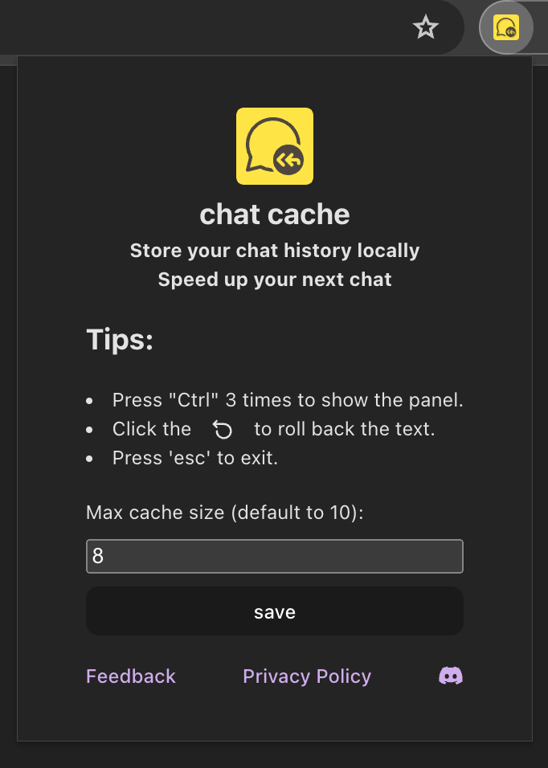
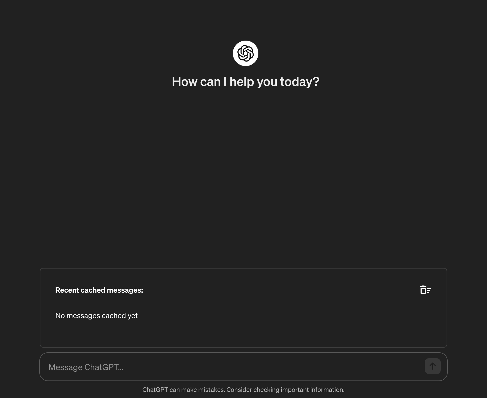
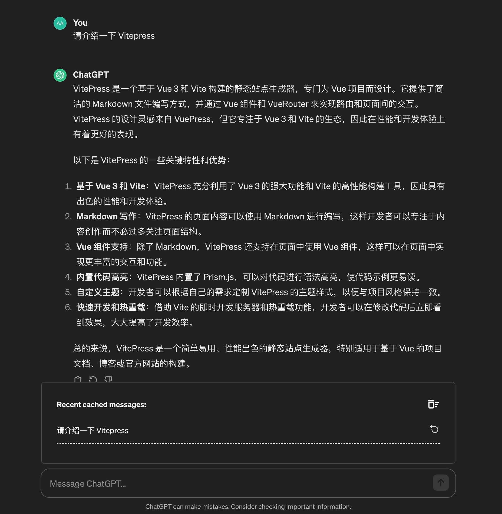

# Getting Started

Chat Cache supports the most popular modern browsers, including Chrome, Microsoft Edge, Firefox, and Safari.

## Install

- [Download Chrome Extension Zip File](/chat-cache-v0.0.3-chrome.zip)
- [Download from Chrome Web Store](https://chromewebstore.google.com/detail/chat-cache/jpacfhgclpnakbomojgmidmfcmjcddgj)
- [Download from Microsoft Edge Web Store](https://microsoftedge.microsoft.com/addons/detail/phdkbmfbhpifdhdkflflgnibakcffoop)

## Quick Start

After installed, you can open the extension by click the "Chat Cache" button in the top right corner of the browser.

### Setup
In the popup card, you can set the number of prompts to be cached. The default value is 10.

While using [chatGPT](https://chat.openai.com/) in the browser, the prompt will be automatically cached.

### Check cache history
To check your cached prompts, press the "ctrl" button 3 times quickly to show the history panel card above the input area.

### Restore prompts

To restore the prompt from the cache, just click the icon button on the right side of the it. The choosen prompt will be restored to the input area.

